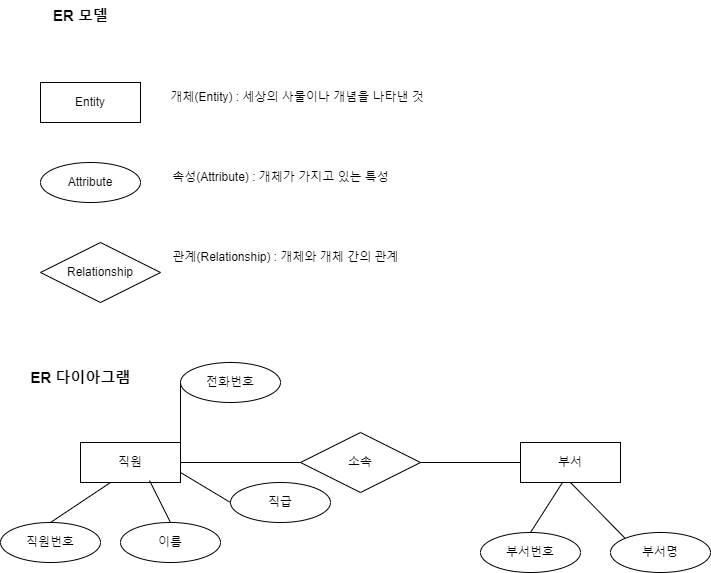
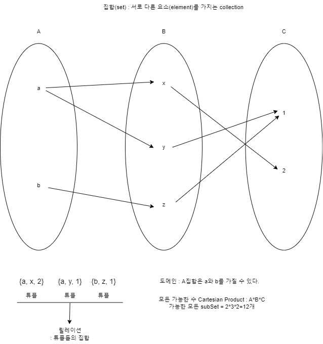
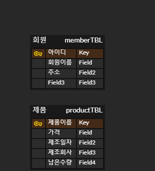

# 데이터베이스
- 전자적으로 저장되고 사용되는 구조적(structed)으로 연관(relate)된 **데이터가 조직화된 집합**

1. 데이터 : 관찰의 결과로 나타난 실제 값
2. 정보 : 데이터에 의미를 부여한 것
3. 지식 : 사물이나 현상에 대한 이해

## 데이터베이스의 개념
1. 통합된 데이터 : 여러 곳에서 사용하던 데이터를 통합하여 하나로 저장
2. 저장된 데이터 : 문서로 보관되지 않고 컴퓨터 등의 전자장치에 저장
3. 운영 데이터 : 업무에 필요한 목적으로 저장된 데이터
4. 공용 데이터 : 여러 사람과 여러 업무에 공동으로 사용되는 데이터

## 특징
1. 실시간 접근
2. 계속 변화
3. 동시 공유
4. 데이터의 값(내용)으로 참조

## 데이터베이스 시스템 구성 요소
1. DBMS(DataBase Management System) : DB를 관리하는 소프트웨어
    - MySQL, Oracle, PostgresSQL, MariaDb, MSSQL ....
2. DB 서버 : DBMS가 실행되는 시스템
3. DB : 하드디스크에 물리적으로 저장되는 데이터를 모아둔 토대
4. 데이터 모델 : 데이터가 저장되는 방법

## 데이터 모델
- 현실 세계의 정보를 어떻게 구조화하고 조직화할지에 대한 청사진
    - 예) 도서관 DB : 책(제목, 저자, 출판년도, 출판사)

    1. 개념적(Conceptual) 데이터 모델
        - 일반 사용자들도 쉽게 이해할 수 있는 개념 모델
    2. 논리적(Logical) 데이터 모델
        - 이해하기 어렵지 않으면서도 상세하게 DB를 구조화 할 수 있는 모델
        - 특정 DBMS에 종속되지 않음.
    3. 물리적(Physical) 데이터 모델
        - 특정 DBMS에 저장이 될 수 있게 디테일하게 설계

### ER모델

### 데이터 모델의 종류
    - 계층형 데이터 모델 (Hierachial 부모-자식 관계 트리구조)
    - 네트워크형 데이터 모델 (Network 다대다 관계)
    - **관계형 데이터 모델** (Relational  데이터를 테이블로 조직화)
    - 객체지향 데이터 모델 (Object-Oriented 데이터를 객체로 표현)
    - NoSQL (Not Only SQL) : 비관계형, 문서, Key-Value

## 스키마와 상태
    - 스키마(Schema) : DB의 구조나 설계
        - 구체적인 데이터 항목이나 값은 포함하지 않음.
        - DB 설계 초기에 정의되고, 상대적으로 변경이 적음.
        - 정적인 특성, 근본적인 요소
    - 상태(Status) : 특정 시점에 DB에 실제로 저장된 데이터 집합
        - 시간에 따라 변할 수 있고 지속적으로 업데이트 
        - DB에 일관성과 무결성 유지를 위해 스키마의 규칙과 제약조건을 따라야 함.
        - 동적인 특성, 변화하는 데이터의 실체

## 3 Schema Architecture
    1. 내부 스키마 : 물리적 저장 장치에 DB가 실제로 저장되는 방법
    2. 개념 스키마 : DB의 논리적 구조, 데이터, 관계, 제약사항, 무결성 등이 포함. 하나의 DB는 개념 스키마가 존재한다.
    3. 외부 스키마 : 일반 사용자나 외부에서 보는 DB의 일부분, View, 하나의 DB에 여러개의 외부 스키마가 있을 수 있음.

## 관계형 데이터 모델

    - 개념정의 
        - 속성(attribute) : 릴레이션이 가지는 개별 집합(열)
        - 도메인(domain) : 집합이 가질 수 있는 개별 값의 집합
        - 튜플(tuple) : 각 속성의 값들로 이루어진 목록(행)
        - 릴레이션(relation) : 튜플들의 집합
        - 차수(degree) : 속성의 개수 
        - 카디널리티(cardinality) : 튜플의 수
    - 테이블로 정의되었을 때의 용어
        - 릴레이션 -> 테이블
        - 튜플 -> 행(row)
        - 속성 -> 열(column)
        - 도메인 -> 데이터 타입

## 무결성 제약조건
    - 무결성(integrity) : 데이터의 정확성과 일관성
    - 제약조건(Constraint) : 무결성을 보장하기 위해 DB 상태를 유지하는 것

1. 개체(Entity) 무결성 제약조건
    - 각 릴레이션의 기본키는 NULL이거나 중복된 값을 가질 수 없다.
2. 참조(Referenctial) 무결성 제약조건
    - 외래 키 값은 NULL일 수 없고, 참조하는 릴레이션의 기본키 값과 같아야한다.
3. 도메인(Domain) 무결성 제약조건
    - 각 속성은 지정된 도메인에 속한 값이어야 한다.

## 키 (Key)
    - 무엇인가를 유일하게 식별한다.
    - 키의 종류
        - 슈퍼 키
            - 정의 : 릴레이션에서 특정 튜플을 식별할 때 사용되는 속성(또는 속성의 집합)
            - 예) 고객(고객번호, 이름, 주민번호, 주소, 핸드폰번호)
                - (고객번호) : 유일한 값이므로 식별 가능
                - (이름) : 동명이인이 있으면 식별 불가
                - (주민번호) : 유일한 값이 부여되므로 식별 가능
                - (주소) : 같은 주소 존재(가족) 가능함으로 식별 불가
                - (핸드폰) : 핸드폰이 없을 수 있고, 2개 이상이면 식별 불가
            - 슈퍼키는
                - 하나의 속성 : (고객번호), (주민번호)
                - 복합 속성 : (고객번호, 이름), (주민번호, 이름, 주소), (고객번호, 주민번호, 이름) ....
        - 후보 키(candidate key)
            - 튜플을 유일하게 식별할 수 있는 속성의 최소 집합
            - (고객번호), (주민번호)
        - **기본 키(Primary key, PK)**
            - 후보 키 중에서 하나를 선정하여 대표로 삼은 키
            - (고객번호)
            - NULL 값이 허용되지 않음
            - 최대한 적은 속성
            - 고유한 값이어야 함
            - 가능한 키 값의 변경이 없어야 함.
        - 대체 키(alternate key)
            - 후보 키 중에서 기본 키로 선택되지 않은 키
            - (주민번호)
        - **외래 키(foreign key, FK)**
            - 다른 키의 기본 키를 참조하는 속성
            - 주문(주문번호(PK), 고객번호(FK), 주문금액, 주문일자)
            - 릴레이션 간의 관계(relationship)를 나타냄

## MySQL Community 설치

## 논리적 데이터 모델
- [ERD CLOUD](http://www.erdcloud.com)
    - 온라인 무료 데이터 모델링 사이트

## 물리적 데이터 모델

## SQL (Structed Query Language)
    - 구조화된 질의 언어
    - 관계형 데이터베이스(RDBMS)에서 데이터 관리를 위해 사용하는 표준화된 언어

1. 데이터 정의 언어(DDL)
    - Data Definition Language
    - CREATE, DROP, ALTER, TRUNCATE, RENATE
2. 데이터 조작 언어(DML)
    - Data Manipulation Language
    - INSERT, UPDATE, DELETE
3. 데이터 질의 언어(DQL)
    - Data Query Language
    - SELECT
    - DML로 포함이 되는 구분도 존재한다.
4. 데이터 제어 언어(DCL)
    - Data Control Language
    - GRANT, REVOKE
5. 트랜잭션 제어 언어(TCL)
    - Transaction Control Language
    - COMMIT, ROLLBACK, SAVEPOINT
            
## 제약조건
- Primary key (PK)
    - 각 행을 유일하게 식별할 수 있는 열(열의 조합)
    - Not Null과 Unique의 속성을 갖는다(개체 무결성)
    - 비어 있어도 안되고, 값이 중복되도 안됨.
- Not Null (NN)
    - 해당 컬러멩는 반드시 유효한 값이 존재해야 함
    - Null값이 허용되지 않음
- Unique (UQ)
    - 해당 컬럼의 각 행은 서로 다른 고유한 값을 가져야함
    - Null은 가능

## 데이터 타입
1. 숫자형 데이터 타입
    - **INT**, INTEGER : 4byte 정수
    - DECIMAL(M, N) : 고정 소수점 숫자
        - M 총자릿수, N 소수점 자리수
    - FLOAT(4byte), DOUBLE(8byte) : 부동 소수점 숫자
2. 문자열 데이터 타입
    - CHAR(N) : 고정 길이 문자열, N은 문자열 길이
    - **VARCHAR(N)** : 가변 길이 문자열
    - TEXT, MIDIUMTEXT, LONGTEXT : 긴 텍스트 저장시
3. 날짜/시간 데이터 타입
    - DATE : 'YYYY-MM-DD' 연-월-일
    - TIME : 'HH:MM:SS' 시-분-초
    - DATETIME : 'YYYY-MM-DD HH:MM:SS'
    - TIMESTAMP : 1970-01-01 기준 32비트 정수 유닉스 기반 날짜시간정보 저장
4. 이진 데이터 타입
    - BINARY(N) : 고정길이 이진데이터
    - VARBINARY(N) : 가변길이 이진데이터
    - **BLOB** : Big Large OBject, 4GB 저장
5. 논리 데이터 타입
    - BOOLEAN : TRUE, FALSE
6. 열거형 데이터 타입
    - ENUM : 미리 정의된 값 중 하나를 저장
        - ENUM('봄', '여름', '가을', '겨울')
- 도메인 무결성 제약조건 : 각 속성은 도메인(데이터타입)에 지정된 값만 가져야한다